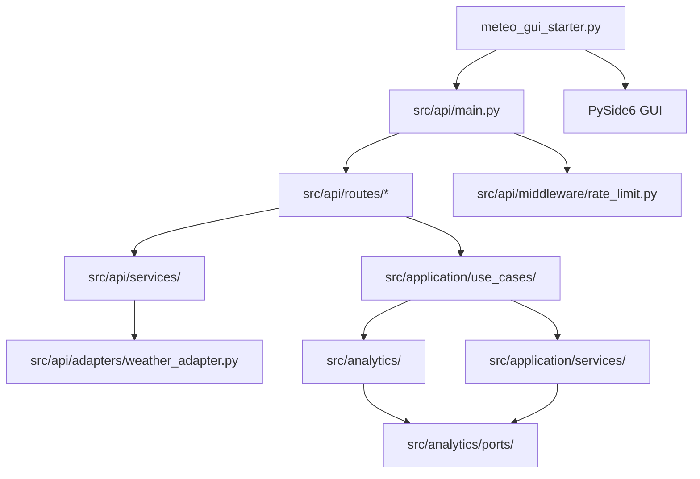

<!-- Generated by arch_map.py on 2026-05-18 -->

# Architecture — meteo-analytics

## Overview
A FastAPI-based weather analytics platform that fetches, processes, and visualizes meteorological data for multiple cities, providing trend analysis, anomaly detection, and wind rose visualizations via a REST API and optional PySide6 GUI.

## Component map

## Key modules
| Module | Purpose | Dependencies |
|--------|---------|--------------|
| src/api/main.py | FastAPI app entry point | fastapi, uvicorn |
| src/api/routes/ | 12 route modules for weather, analytics, anomalies, wind rose | fastapi, pydantic |
| src/api/adapters/weather_adapter.py | External weather API adapter | httpx |
| src/api/middleware/rate_limit.py | Rate limiting middleware | anyio |
| src/analytics/multi_city_engine.py | Multi-city analytics orchestration | pandas, geopandas |
| src/analytics/wind_analysis.py | Wind pattern analysis | scipy, numpy |
| src/application/use_cases/ | Use case orchestration | all analytics modules |
| src/application/services/ | Wind analysis service & extractors | pandas, scikit-learn |
| meteo_gui_starter.py | Standalone PySide6 GUI launcher | PySide6, requests |

## External dependencies
fastapi, uvicorn, pydantic, pydantic_core, httpx, anyio, pandas, geopandas, numpy, scipy, scikit-learn, plotly, matplotlib, PySide6, PySide6_Addons, PySide6_Essentials, PyQtDarkTheme2

## Data flow
External weather data → weather_adapter → API routes → application use cases → analytics engines → DTOs → JSON responses (or GUI via HTTP).

## Known risks / open questions
- `src/api/routes/wind_rose_part1/2/3.py` and `wind_rose_support.py` are split across 4+ files for unclear reasons (potential duplication)
- `analyze_multi_city.py` and `analyze_multi_city_support.py` may indicate logic bloat
- `multi_city_engine.py` and `multi_city_engine_core.py` have no clear separation of concerns
- Scripts directory contains bespoke audit/test tools not integrated into CI
- `scripts/ultimate_project_analyzer.py` suggests ad-hoc analysis tooling
- No explicit authentication or authorization middleware visible
- GUI starter (`meteo_gui_starter.py`) has no integration tests
