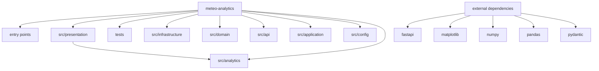

# Architecture

## Overview
- Project root: `meteo-analytics`.
- Python files mapped: 863.
- Primary entrypoints: `meteo_gui_starter.py`, `scripts/add_city_name_index.py`, `scripts/gui_audit.py`, `scripts/test_city_name_flow.py`, `scripts/test_fetch_flow.py`, `scripts/ultimate_project_analyzer.py`.

## Mermaid Map

## Key Modules
| Module | Role | Evidence |
|---|---|---|
| `src/presentation` | entry or interface | `src/presentation/__init__.py`; Presentation package. |
| `tests` | tests and checks | `tests/__init__.py`; 237 Python files |
| `src/infrastructure` | infrastructure | `src/infrastructure/__init__.py`; Infrastructure package. |
| `src/domain` | domain model | `src/domain/__init__.py`; 45 Python files |
| `src/api` | [?] mapped module group | `src/api/__init__.py`; API package for FastAPI entrypoints. |
| `src/application` | application logic | `src/application/__init__.py`; Application Layer - Use Cases and Business Logic Orchestration. |
| `src/config` | [?] mapped module group | `src/config/__init__.py`; Global Weather Analyzer - Configuration Module |
| `src/analytics` | [?] mapped module group | `src/analytics/__init__.py`; Analytics Module - Magyar MVP Clean Version |

## External Deps
- `anyio`
- `bandit`
- `detect-secrets`
- `fastapi`
- `geopandas`
- `httpx`
- `import-linter`
- `matplotlib`

## Data Flow
- Entrypoints: `meteo_gui_starter.py`, `scripts/add_city_name_index.py`, `scripts/gui_audit.py`, `scripts/test_city_name_flow.py`, `scripts/test_fetch_flow.py`, `scripts/ultimate_project_analyzer.py`.
- Internal flow follows static imports across `src/presentation`, `tests`, `src/infrastructure`, `src/domain`, `src/api`, `src/application`, `src/config`, `src/analytics`.
- External calls/imports mapped to `fastapi`, `matplotlib`, `numpy`, `pandas`, `pydantic`, `pytest`, `requests`, `sklearn`.

## Known Risks
- Static map only; runtime configuration and dynamic imports are not expanded [?].
